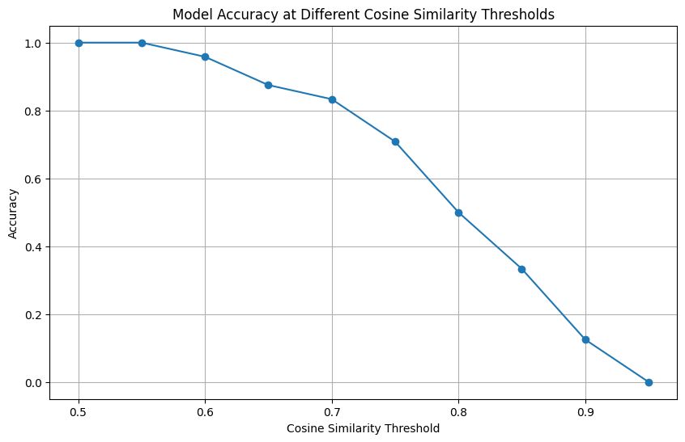

# LLM-RAG System for FCRA Compliance

## Overview

This project develops a Retrieval-Augmented Generation (RAG) system to enhance the accessibility and understanding of the Fair Credit Reporting Act (FCRA) for users needing to comply with consumer reporting requirements. By leveraging advanced natural language processing techniques within a structured knowledge base of legal documents, the system provides precise, contextually relevant information to facilitate compliance.

## Problem Description

Understanding and implementing FCRA regulations can be challenging due to the complexity and detailed nature of the legal text involved. This project addresses the need for a more accessible and efficient method to navigate these documents, using a RAG system that improves the retrieval and contextualization of legal information, thus aiding compliance efforts.

## Project Components

- Text Files: Original FCRA documents used as the primary data source for the project, converted into textual format for processing.
- JSON Files: These files represent chunked and embedded versions of the text documents, optimized for efficient information retrieval within the RAG system.
- Ground Truth JSON File: Created to serve as a benchmark for evaluating the RAG system's performance. Each file contains modules with summaries, questions, and ground truth answers.
- Notebooks:
    - 01.preprocessing_embedding_rag.ipynb: Contains the preprocessing steps to transform text data into a searchable format, preparing it for use in the retrieval system, indexing, and implement generation part (Compelete RAG system)
    - 02.create_ground_truth.ipynb: Using LLM to created ground truth JSON file to serve as a benchmark for evaluating the RAG system's performance. Each file contains modules with summaries, questions, and ground truth answers.
    - 03.loading_embeded_data_rag_and_evaluation.ipynb: Implements the RAG system using the preprocessed data (embeded version of the text documents in JSON format), facilitating efficient retrieval, generation of answers. This notebook is also include evaliuation of the RAG system. Code that processes the ground truth data and compares the RAG system's answers to the ground truth answers by computing embeddings, calculating cosine similarity, and assessing accuracy.
- Source Code (app.py): The final application script that integrates the RAG system, enabling user interaction with the FCRA knowledge base through queries.

## Setup and Installation

1. Dependencies: Python dependencies are managed using Poetry. Install the necessary packages by running:

```bash
poetry install
```
	
2. Elasticsearch Setup: The project utilizes Elasticsearch for handling vector-based search operations. Set up the Elasticsearch service using Docker with the following command:
    
```bash
    docker run -d \
    --name elasticsearch \
    -m 4GB \
    -p 9200:9200 \
    -p 9300:9300 \
    -e "discovery.type=single-node" \
    -e "xpack.security.enabled=false" \
    -v esdata:/usr/share/elasticsearch/data \
    --restart unless-stopped \
    docker.elastic.co/elasticsearch/elasticsearch:8.5.1
```

- This setup ensures that Elasticsearch operates in a single-node configuration with security features disabled for simplicity, and it restarts automatically unless manually stopped.

3. Running the Notebook: Process the data through the preprocessing notebook:

```bash
poetry run jupyter notebook 01.preprocessing.ipynb
```

4. Running the Application: The Streamlit-based application can be started with:

```bash
poetry run streamlit run app.py
```
- This command initializes the user interface, allowing for interactive query processing.

5. Deployment: The application is deployed directly on a GCP VM, ensuring robust performance and availability. Access the live application via: http://35.208.255.123:8501/


## Functionality

The application provides a Streamlit interface where users can submit queries regarding FCRA regulations. It retrieves pertinent information from the knowledge base using Elasticsearch and generates responses through the RAG system, ensuring that the outputs are not only accurate but also contextually tailored to the user’s inquiries.

## Features

- Advanced Search: Incorporates vector-based searching for high precision and relevance in response generation.
- User Interface: Designed with Streamlit, the interface offers a clean, intuitive way for users to interact with the model, enhancing user experience and engagement.
- Deployment: Hosted on a GCP VM, the system is set up for high reliability and continuous access, facilitating ongoing user interaction.

## Evaluation

### Ground Truth Data Creation

To evaluate the performance of the RAG system, ground truth JSON files were created. Each file corresponds to a module of the FCRA document and includes:
- Summary: A concise overview of the module's content.
- Questions and Answers: A set of carefully crafted questions relevant to the module's content, along with their correct answers.

Example Format:

```json
{
  "Module 01.txt": {
    "summary": "Summary of Module 1...",
    "questions_and_answers": "1. Question: What is...?\nAnswer: The answer is...\n\n2. Question: How does...?\nAnswer: It does so by..."
  },
  "Module 02.txt": {
    // Similar structure
  }
}
```

Evaluation Methodology
The evaluation involves comparing the RAG system's answers to the ground truth answers using embedding techniques and calculating cosine similarity.
1. Embedding Answers: Both the ground truth answers and the RAG-generated answers are embedded using a pre-trained language model (e.g., Sentence Transformers).
2. Calculating Cosine Similarity: The cosine similarity between the embeddings of the ground truth answers and the RAG answers is calculated to measure semantic similarity.
3. Accuracy Assessment: By setting a cosine similarity threshold (e.g., 0.8), we determine whether the RAG answer is considered correct. Accuracy is calculated as the proportion of correct answers over the total number of questions.
4. Plotting Results: The accuracy of the model is plotted against different cosine similarity thresholds to visualize the model's performance and to help select an optimal threshold.

### Evaluation Results
The evaluation showed that as the cosine similarity threshold increases, the accuracy of the model changes accordingly. By plotting the accuracy against different thresholds, we identified the threshold that provides the best balance between accepting correct answers and rejecting incorrect ones.



The evaluation demonstrates that the RAG system effectively retrieves and generates answers that are semantically similar to the ground truth answers. The cosine similarity metric provides a quantitative measure of this similarity, and the accuracy assessment helps in understanding the model's performance at different thresholds.
By analyzing the plot, we can select an optimal threshold that maximizes the model's accuracy, ensuring that the system provides reliable and accurate information to the users.

## Conclusion

This LLM-RAG project represents a significant advancement in the application of NLP techniques to legal compliance. By simplifying the interpretation and application of FCRA regulations, the system serves as a crucial tool for users ranging from legal experts to financial institutions, ensuring they can more easily meet regulatory requirements.
The addition of a rigorous evaluation component enhances the project's credibility by quantitatively demonstrating the system's effectiveness. The process of embedding and comparing answers provides valuable insights into the model's performance, guiding further improvements and optimizations.